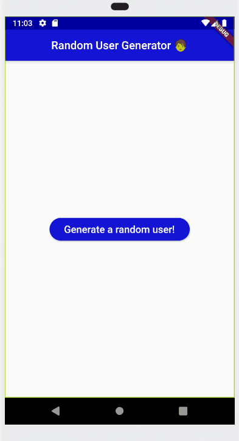

# random_user

A new Flutter project.

A quick project I made to refresh on using the http package in flutter and also basic layout.
It uses the randomuser.me API to get randomly generated user data. This is displayed on the screen
after the completion of the request.

